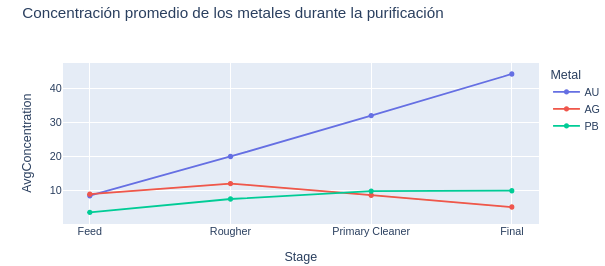
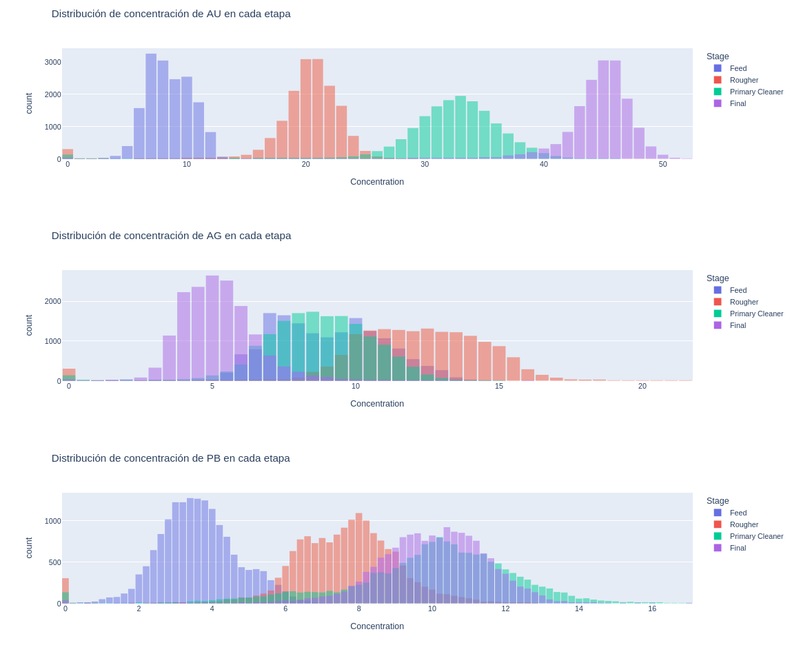

# gold-recovery-prediction-triple-ten-project
Este proyecto consiste en construir un modelo de machine learning para predecir la recuperación de oro en una planta de procesamiento de minerales, basado en datos industriales recopilados durante distintas etapas del proceso, Proyecto de TripleTen

El objetivo principal es maximizar la eficiencia de recuperación y ayudar a automatizar decisiones dentro del entorno de producción.

📁 Archivos del proyecto
gold_recovery_train.csv: conjunto de entrenamiento.

gold_recovery_test.csv: conjunto de prueba (sin objetivos).

gold_recovery_full.csv: conjunto fuente con todos los datos disponibles.

🧪 Objetivo del proyecto
Validar la calidad de los datos obtenidos del sistema de monitoreo de procesos.

Analizar cómo varían los parámetros físicos y químicos a lo largo de las distintas fases del proceso.

Entrenar un modelo que prediga correctamente la recuperación de oro (rougher.output.recovery y final.output.recovery), usando la métrica sMAPE.

Evaluar el modelo con validación cruzada y métricas específicas del negocio.

🛠️ Estructura del análisis
1. Preparación de los datos
Carga y exploración de los datasets.

Verificación de la fórmula de recuperación de oro y validación de sus valores.

Detección de columnas ausentes en el conjunto de prueba.

Conversión de columnas de fecha y otros tipos de datos.

Limpieza y tratamiento de valores faltantes y anomalías.

2. Análisis exploratorio (EDA)
Análisis de la evolución de la concentración de metales (Au, Ag, Pb) en cada etapa del proceso.

Comparación de la distribución del tamaño de partículas entre conjunto de entrenamiento y prueba.

Análisis de la suma total de concentraciones para identificar valores físicamente imposibles.

3. Modelado predictivo
Definición de la métrica personalizada sMAPE.

Entrenamiento de varios modelos (regresión lineal, árbol de decisión, RandomForest, etc.).

Comparación de desempeño mediante validación cruzada.

Elección del mejor modelo y evaluación sobre conjunto de prueba.

📊 Métrica utilizada: sMAPE
Se usó el Error porcentual absoluto simétrico modificado (sMAPE) para evaluar el rendimiento del modelo, tal como se exige en entornos industriales donde las métricas deben ser robustas frente a valores extremos:

sMAPE_rougher

sMAPE_final

sMAPE_total (ponderación: 25% rougher, 75% final)

✅ Resultados
El modelo final logró un rendimiento aceptable según los criterios de negocio.

Se identificaron variables altamente correlacionadas con la recuperación de oro.

El proceso de análisis permitió eliminar valores anómalos y mejorar la estabilidad de las predicciones.

🧠 Herramientas utilizadas
Python (Pandas, NumPy, SciKit-Learn, Matplotlib, Seaborn)

Jupyter Notebook

Validación cruzada

Ingeniería de características y limpieza de datos

📌 Nota
El conjunto de prueba no incluye las variables objetivo, por lo que las predicciones se evalúan de forma indirecta en función de su comportamiento sobre el conjunto completo (gold_recovery_full.csv).
